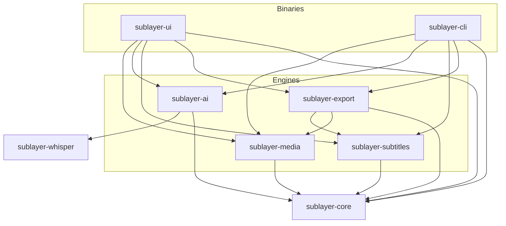

# Sublayer

Local-first AI video caption studio for Linux. Sublayer transcribes your
footage with Whisper, turns the word stream into punchy caption cards, and
burns animated subtitles straight into a finished video — optionally on the
GPU. Everything runs on your machine; the only network access is the one-time
Whisper model download.

```
video ──▶ ffprobe ──▶ 16 kHz audio ──▶ Whisper (VAD + word timestamps)
                                             │
                                             ▼
                                   caption cards (segmentation)
                                             │
                    ┌────────────────────────┴────────────────────────┐
                    ▼                                                 ▼
        Slint desktop studio                                  headless CLI
   (preview, timeline, inspector)                     (transcribe / render / probe)
                    │                                                 │
                    └────────────────────────┬────────────────────────┘
                                             ▼
                              FFmpeg burn-in (VA-API · NVENC · CPU)
```

## Highlights

- **Word-level transcription** with whisper.cpp through the workspace's own
  `sublayer-whisper` bindings (built on the raw `whisper-rs-sys` FFI; GGML
  models pinned by SHA-256), DTW-aligned word timestamps, an energy-based VAD
  pre-filter that skips silence, and bounded inference windows so alignment
  stays accurate over music-heavy clips.
- **Caption cards** built by clustering heuristics: sentence endings, pauses,
  clause boundaries, and per-card length/duration ceilings.
- **ASS compiler** with karaoke, word-pop, and bounce animations, plus five
  built-in themes (TikTok Classic, Hormozi Bold, Clean Podcast, Cyber Gaming,
  Minimal Cinematic) and custom JSON themes.
- **Slint desktop studio**: decoded frame preview with a live caption overlay,
  an interactive waveform timeline with draggable/trimmable caption cards,
  and a style inspector that edits the theme as you type.
- **Hardware-accelerated export**: probes VA-API, then NVENC, then falls
  back to `libx264`, retrying at runtime when a probed encoder cannot start
  (a Vulkan backend is compiled in only with the `encode_vulkan` feature);
  streams percentage, fps, and ETA while rendering.
- **Headless CLI** for batch and CI workloads: `probe`, `transcribe`, `render`.
- **Packaging**: Flatpak manifest (`--device=dri`, Wayland & PipeWire sockets)
  and an AppImage build script.

## Requirements

| Requirement | Notes |
| --- | --- |
| Linux | Wayland or X11; the studio uses a plain winit window, no XEmbed tricks |
| Rust | 1.92+ for the desktop UI (Slint), 1.85+ for everything else |
| FFmpeg | `ffmpeg` **and** `ffprobe` on `PATH`; override with `SUBLAYER_FFMPEG` / `SUBLAYER_FFPROBE` |
| Fonts | Bundled in `assets/fonts/` (SIL OFL 1.1, plus freeware Komika Axis); override with `SUBLAYER_FONTS_DIR` |
| GPU | optional: Vulkan for Whisper, VA-API/NVENC for encoding, `--device=dri` when sandboxed |

Whisper models are downloaded on demand into `$XDG_DATA_HOME/sublayer/models/`
and verified against pinned SHA-256 digests. Pinned names: `tiny.en`,
`base.en`, `small.en`, `large-v3-turbo`.

## Build and run

```sh
git clone https://github.com/sublayer-rs/sublayer
cd sublayer
cargo build --release

# Desktop studio
./target/release/sublayer-ui

# Headless CLI
./target/release/sublayer --help
```

GPU-accelerated Whisper needs the Vulkan backend compiled in (Vulkan SDK at
build time); without it the app runs on the CPU even when GPU is requested:

```sh
cargo build --release -p sublayer-ui -p sublayer-cli --features sublayer-ai/vulkan
```

## Desktop studio

1. **Open a video** — Browse… or type a path. Sublayer probes it, extracts
   16 kHz mono audio, and builds the waveform.
2. **Transcribe** — pick a model, optionally GPU and VAD, then run it; the
   header shows progress and the timeline fills with caption cards.
3. **Edit** — scrub the ruler or waveform, drag cards to retime them, drag
   their edges to trim, and retype captions in the inspector. Presets and
   style controls update the preview overlay immediately; the overlay also
   pops the word under the playhead in the theme's highlight color.
4. **Export** — `Export ASS` writes the subtitle file; `Export Video` picks a
   destination and burns the captions in with the probed encoder. The status
   bar shows the render percentage, fps, and ETA, then the encoder that
   finished the render.
5. **Save** — `.sublayer` project files keep the video path, metadata, caption
   cards, and theme together.

Timeline controls: `Play` moves the playhead on the wall clock while the
preview decodes frames as it advances, wheel pans, `Ctrl`+wheel zooms,
`−`/`+`/`Fit` adjust the zoom, and the ruler or waveform seeks. **Right-click
the timeline** to add a caption whisper missed: a menu offers to insert a
placeholder card at that time, which you then retype in the inspector or the
captions drawer.

**Captions drawer** — the header's `Captions` button slides a timestamped,
YouTube-style list of the caption cards in from the right. Click a row's
timestamp to seek to and select that card, or edit the text inline; the
drawer, the timeline, and the inspector stay in sync.

## CLI reference

```sh
# Inspect a file: duration, resolution, fps, audio layout (JSON on stdout)
sublayer probe input.mp4

# Transcribe and compile captions; the extension picks the format
sublayer transcribe input.mp4 -m base.en -o subs.ass     # .ass | .srt | .vtt | .json
sublayer transcribe input.mp4 --theme hormozi -o subs.srt --language en --no-vad

# Render captions into a video (transcribes first unless --subtitles is given)
sublayer render input.mp4 -o out.mp4 --theme tiktok-classic
sublayer render input.mp4 -o out.mp4 --subtitles subs.ass --encoder cpu --quality 18
```

Render flags: `--subtitles <file.ass>` skips transcription, `--encoder
auto|vaapi|nvenc|cpu` forces a backend (`vulkan` additionally, in
the `encode_vulkan` feature build), `--quality 0–51` sets `-crf`
(x264), `-cq` (NVENC), or `-qp` (VA-API/Vulkan). Progress (percentage, fps,
ETA) is painted on stderr, so output can be piped safely. With `auto`, a
backend that fails at startup is retried down the chain and the CLI prints
the fallback. Cards wider than the frame are scaled down automatically to
fit the video width.

## Hardware acceleration

- **VA-API** (Intel/AMD) is used when a `/dev/dri/renderD*` node exists *and*
  the FFmpeg build lists `h264_vaapi`; frames are converted to NV12 and
  uploaded with `hwupload`.
- **NVENC** (NVIDIA) is used when an NVIDIA device node is present *and*
  `h264_nvenc` is available.
- **Vulkan** is the Mesa video-encode path (`h264_vulkan`, RADV) and is
  **opt-in**: unstable drivers have been observed to reset the GPU on
  encode, so default builds compile it out. Build with
  `--features encode_vulkan` (`cargo build --release -p sublayer-cli
  --features encode_vulkan`) to enable it. When compiled in, it is probed
  like VA-API (render node plus encoder listed) and sits after NVENC in the
  chain: a machine whose VA-API driver is broken or missing but whose Vulkan
  video driver works still renders on the GPU. NVIDIA systems have no render
  node, so they never pick Vulkan over NVENC.
- Otherwise the render falls back to `libx264` (`-preset medium`).
- An `auto` render keeps the whole chain: when a probed encoder fails to
  start (a driver may list `h264_vaapi` yet expose no usable encode
  profile), the render retries the next backend and finishes on the first
  one that starts, last resort `libx264`.
- An explicit `--encoder` (or `SUBLAYER_ENCODER`) pins one backend: an
  unavailable or failing one is reported rather than silently downgraded.

Whisper GPU is selected at runtime with the GPU switch (`--gpu` on the CLI)
and requires the Vulkan-enabled build.

## Environment variables

| Variable | Effect |
| --- | --- |
| `SUBLAYER_FFMPEG` / `SUBLAYER_FFPROBE` | Explicit executables, useful inside Flatpak or custom installs |
| `SUBLAYER_FONTS_DIR` | Font directory handed to libass (`fontsdir=`) |
| `SUBLAYER_ENCODER` | Encoder preference: `auto`, `vaapi`, `nvenc`, `cpu` (`vulkan` with the `encode_vulkan` feature) |
| `RUST_LOG` | Log filter for diagnostics (stderr); whisper.cpp/ggml output is routed here as the `whisper` target, e.g. `RUST_LOG=sublayer_media=debug,whisper=debug` |
| `SLINT_BACKEND` | Force a Slint backend, e.g. `winit-software` without GL drivers |

XDG locations: models in `$XDG_DATA_HOME/sublayer/models`, configuration in
`$XDG_CONFIG_HOME/sublayer`, disposable caches in `$XDG_CACHE_HOME/sublayer`.
Runs keep their extracted WAV and waveform cache in a private temporary
directory that is removed on exit.

## Architecture

Sublayer is a multi-crate workspace with a strict unidirectional dependency
flow; the UI and CLI are thin shells over the engine crates.

| Crate | Responsibility |
| --- | --- |
| `sublayer-core` | Domain models (`Project`, `CaptionSegment`, `WordToken`, `ThemeStyle`), XDG paths, errors |
| `sublayer-media` | FFprobe wrapper, 16 kHz audio extraction, waveform decimation, frame preview, shared FFmpeg process layer |
| `sublayer-ai` | Model downloader with SHA-256 verification, VAD, Whisper transcription with word timestamps |
| `sublayer-whisper` | Leak-free safe bindings to whisper.cpp over the raw `whisper-rs-sys` FFI; the only crate allowed `unsafe` |
| `sublayer-subtitles` | Word clustering, ASS/SRT/VTT compilation, theme presets and JSON I/O, font directory resolution |
| `sublayer-export` | VA-API/NVENC/Vulkan/CPU probing, FFmpeg burn-in runner, progress and ETA stream |
| `sublayer-ui` | Slint desktop studio (window, timeline, inspector, bridge to Tokio) |
| `sublayer-cli` | `sublayer` binary: probe, transcribe, render |



Whisper inference goes through `sublayer-whisper`, which wraps the raw
`whisper-rs-sys` FFI over whisper.cpp with borrowed (never boxed) progress
callbacks, freed-in-`Drop` pointers, and bounds-checked iteration. It is the
single `unsafe` boundary in the workspace; every other crate compiles under
`unsafe_code = "deny"`.

Project layout:

```text
crates/
  sublayer-core/  sublayer-media/  sublayer-ai/  sublayer-whisper/
  sublayer-subtitles/  sublayer-export/  sublayer-ui/  sublayer-cli/
assets/fonts/       bundled caption fonts (SIL OFL 1.1)
assets/icons/       desktop icons
packaging/flatpak/  Flathub manifest
packaging/appimage/ AppRun + AppImage build script
```

## Development

```sh
cargo test --quiet --workspace   # unit + integration tests
cargo clippy --workspace --all-targets
cargo fmt --all --check
```

Testing strategy:

- Engine crates are headless: transcription, segmentation, ASS generation, and
  encoder probing are unit-tested without a display server or a GPU. Tests
  that need FFmpeg print why they skipped when it is missing.
- `sublayer-export` covers a real CPU burn-in end to end, including
  cancellation when the progress receiver is dropped and paths containing
  filter separators (`:`, `'`, spaces).
- `sublayer-ui` drives the Slint tree on the testing backend: it checks the
  property projection, retimes a caption card by dispatching real pointer
  events with mock time, and runs without Wayland/X11. VA-API, NVENC, and
  Vulkan paths need a GPU host to be exercised end to end; they are probe-
  and argument-tested on CPU-only machines.
- Whisper end-to-end tests are `#[ignore]`d because they need a downloaded
  model; run them with `SUBLAYER_TEST_MODEL=/path/to/ggml-base.en.bin cargo
  test -- --ignored`.

## Packaging

**Flatpak**

```sh
flatpak-builder --user --install --force-clean build-dir \
    packaging/flatpak/com.vastorigins.Sublayer.yml
```

The manifest exposes `--device=dri` (VA-API), Wayland plus fallback X11,
the PipeWire socket, portal access for native file dialogs, and the
`ffmpeg-full` runtime extension for the x264/VA-API encoders. Model downloads
happen inside the sandbox's private data directory.

**AppImage**

```sh
packaging/appimage/build-appimage.sh [output.AppImage]
```

The script builds the release binaries, assembles an AppDir (binaries, desktop
entry, icon, bundled fonts, `AppRun`), optionally bundles host libraries with
`linuxdeploy` (`LINUXDEPLOY=/path/to/linuxdeploy`), and packs the image with
`appimagetool` (`APPIMAGETOOL=/path/to/appimagetool`). AppDir contents land in
`packaging/appimage/AppDir`, which is git-ignored.

## Status

Phases 1–5 of the implementation roadmap are complete: workspace foundation,
media pipeline, AI speech pipeline, subtitles and animation engine, the Slint
studio, and hardware-accelerated export with packaging. Known gaps include
per-render quality settings in the UI (the CLI has `--quality`), audio during
the playback preview, and AppStream metadata for Flathub.

## License

The workspace is licensed under MIT OR Apache-2.0.

Two exceptions to keep in mind:

- **Slint** (used by `sublayer-ui`) is licensed under `GPL-3.0-only`,
  `LicenseRef-Slint-Royalty-free-2.0`, or `LicenseRef-Slint-Software-3.0`.
  Distributing binaries that link `sublayer-ui` is therefore subject to
  Slint's terms — see the Slint licensing documentation for which option
  applies to your use case.
- **Bundled fonts** in `assets/fonts/` are SIL OFL 1.1; see
  [`assets/fonts/README.md`](assets/fonts/README.md).
